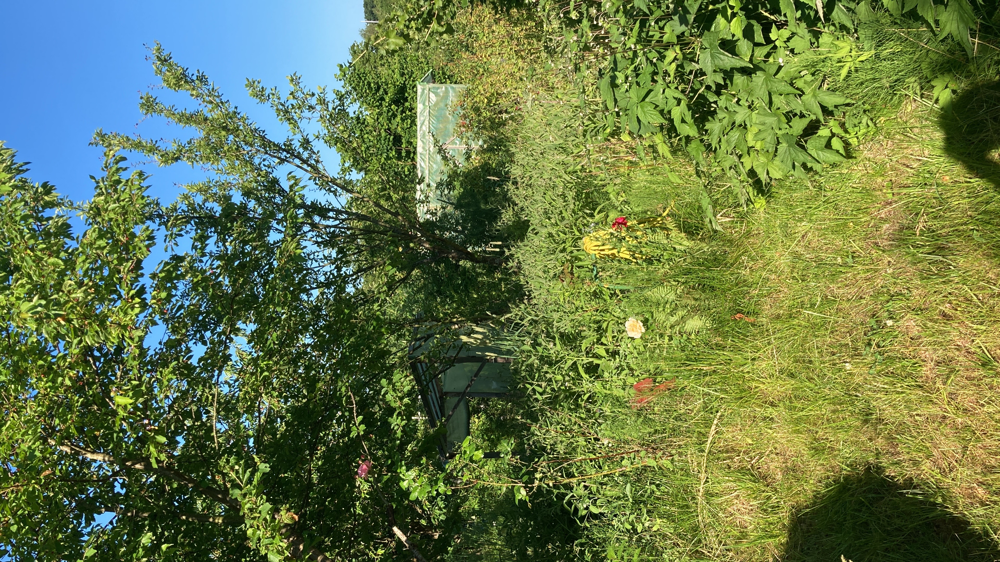
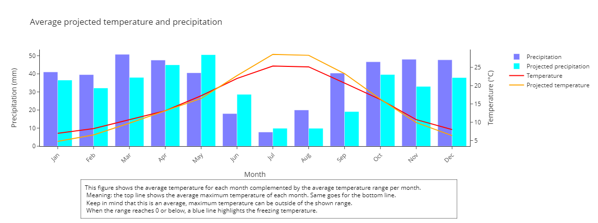

# Visualisising meteorological data

With this project we want to make complex meteorological data accessible to people who want to start a permaculture project. We provide intuitive graphical representations of weather informations for a location of your choosing as well as projections on the evolution of the climate in the future. 
To render the data more accessible we provide a dashboard in addition to a Jupyter notebook. 

As a biologist, a gardener and a permaculture beginner myself, I am aware of the importance of knowing the general climate tendencies of a location when planning what to plant, both for one and for multiple years. 
As establishing a healthy and balanced ecosystem is a longterm endavour, and climate change is a rising issue, we included climate projections for the next 30 years. 
Here we, a biologist and a meteorologist, teamed up to provide exactly that: a summary of the local climate, easy to understand without technical knowledge. 

  

    
     
  

The pictures above show my personal garden, what looks like chaos on the right is a selected mix of local plant species that try to provide a good and healthy habitat to insects, birds and small mammals. 

## Datasets

The dataset used for the past climate data is the [ERA5 monthly averaged data on single levels from 1940 to present](https://cds.climate.copernicus.eu/cdsapp#!/dataset/reanalysis-era5-single-levels-monthly-means?tab=overview).
This dataset provides data on a number of different variables from 1940 to the present, offering a resolution of 0.25 degrees. Here we will present rainfall, temperature, humidity, wind diretion and speed and total cloud cover, as we think these variables are the more important when it comes to starting a permaculture project. 
As we take a box of 2x2 ° (roughly 250x250 km) around the selected location, the graphs we provide here will give you an idea of the general climate in your region.

For the projecton data we opted for the [CMIP6 climate projections](https://cds.climate.copernicus.eu/cdsapp#!/dataset/projections-cmip6?tab=form) dataset coming from CDS. This dataset assumes a rise in temperature of 4.5 °C, as well as a shared socioeconomic pathway index of 2. We opted for those two options as they offer a scenario with intermediate challenges and are the middle pathway of all available scenarios.  
For more information on the dataset and the criteria of the scenarios we recommend the paper: [The Scenario Model Intercomparison Project (ScenarioMIP)
for CMIP6](https://gmd.copernicus.org/articles/9/3461/2016/gmd-9-3461-2016.pdf). 
From this dataset we took projected rainfall, temperature, wind speed and direction. 

## Graphical representation of the data 

Here we want to show one of our graphs as an example. This particular graph is made for Puebla de don Fadrique, Spain, as there is a starting permaculture project we provide the data for. 

## Future steps and expansion

While our dashboard runs locally, we developed it in a way that it can be deployed online without much extra effort. 

We would also like to include biological information specifically centered around permaculture. Meaning, in addition to the meteorological data provided here, the user gets a list of plants that grow in the selected area, and ideally also infromations on grwoth temperature, water needs, and so on. This was not realisable yet as this information is not accessible for plant species that are outside of the main agricoltural focus, but are really important for a local ecosystem and therefore permaculture. 