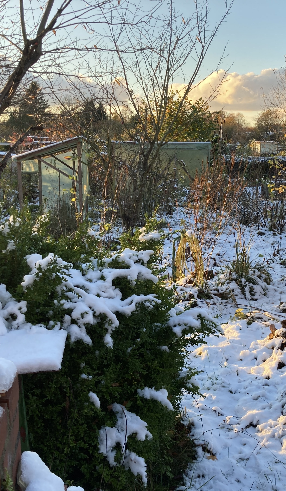

In this project we want to aid people who have a garden or want to create one, by providing localised weather informations as well as projections on the evolution of the weather.

Beeing both a gardener and a biologist, I know first hand how important the weather can be for a garden and the organisms living in it. Especially if you have longterm projects involving permaculture, a planing phase before starting is essential. 
To aid with longterm plans we provide local data derived from 30 years of past weather informations, as well as a projection into the future evolution of the local climate 
As a garden can be a longtime commitment, we also provide data for how the weather is supposed to evolve

  

    
     
  

The dataset used for the past weather data is the [ERA5 monthly averaged data on single levels from 1940 to present](https://cds.climate.copernicus.eu/cdsapp#!/dataset/reanalysis-era5-single-levels-monthly-means?tab=overview).
From 

## Projection dataset

For the projecton data we opted for the [CMIP6 climate projections](https://cds.climate.copernicus.eu/cdsapp#!/dataset/projections-cmip6?tab=form) dataset coming from CDS. This dataset assumes a rise in temperature of 4.5 °C, as well as a shared socioeconomic pathway index of 2. We opted for those two options as they offer a scenario with intermediate challenges and are the middle pathway of all available scenarios. 

For more information we recommend the paper: [The Scenario Model Intercomparison Project (ScenarioMIP)
for CMIP6](https://gmd.copernicus.org/articles/9/3461/2016/gmd-9-3461-2016.pdf). 
