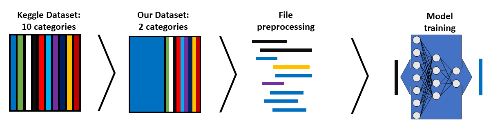
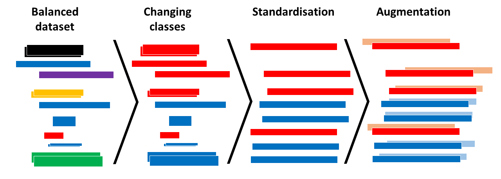
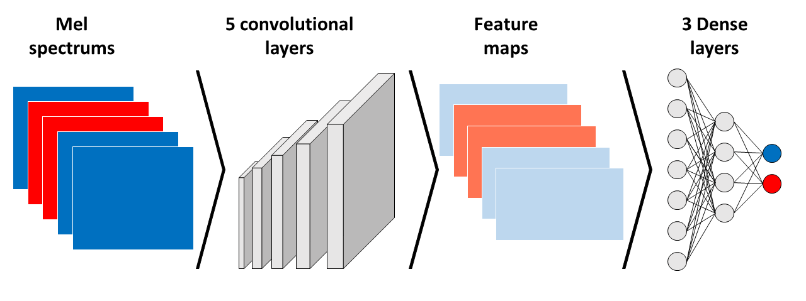
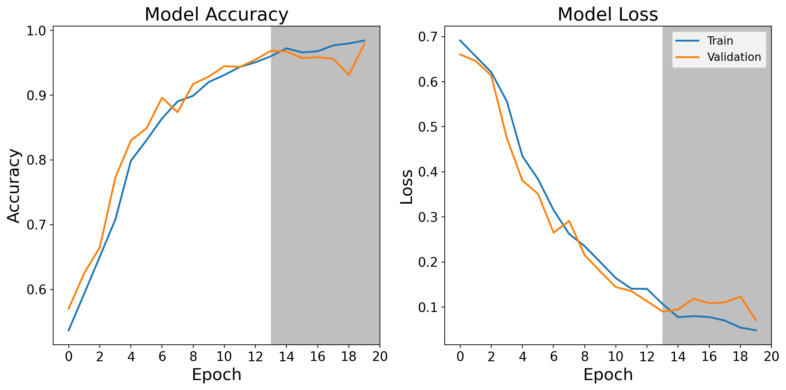

## Reducing Emissions in Car Carriers: An AI-Based Alert System

With this project, we wanted to create an AI that can be used to recognize the sound of idling engines in order to give automated warnings, either visual or acoustic. This can be used at any place where cars are not supposed to be left running in confined spaces, such as ships, enclosed trains and underground parkings. 

## What we learned/improved
- Applied Fourier and Mel-Spectrum transformations for effective input  to a Neural Network
- Build and optimise a CNN Model for sound recognition with Tensorflow
- Project collaboration using GitHub 
- Learned collaborative project management skills within a small team

As a kid, my family took me and my brother to places like Sardinia or some Greek Island. As we wanted to take our car with us, we always used an auto ferry to get there. Life was good, until we got to the moment of disembarking. All passengers were called to the car decks to wait by their cars. These decks can get quite warm, especially in the mediterranean summer, so a lot of people had the idea to get into their cars and turn the engine on to get the air conditioning to work. While this was nice for them, it is not ideal to have a lot of cars with engines running in a confined space with limited ventilation, as this further increases the temperature and, more importantly, increases the amount of exhaust fumes all passengers outside of cars have to breath. While there were signs that said it is not allowed to leave the car on, the sailors were too busy with the docking operations to enforce this.

This project was developed in collaboration with a friend, [Giacomo Labbri](https://giacomo-lab.github.io/).

### 1. The data
We took the [UrbanSounds8k](https://www.kaggle.com/datasets/chrisfilo/urbansound8k) dataset from Kaggle. This data set comprises urban sounds from 10 different classes of urban sounds. As the scope of our project is the training of a neural network to recognise engine idling sounds, we created a sub dataset where we kept only the engine idling sound and an equal amount of sounds randomly picked from the remaining nine classes. Following this, we preprocessed the files and used them to train our model.

### 2. Preprocessing
First thing we did was categorize the files into two classes: `engine_idling` and `non_engine_idling`, the second one containing the files of the other nine classes. 

While all files were stored as .wav files, they showed some differences. To standardize the files within our balanced dataset, we first converted them all to one channel (mono), a sampling rate of 44100 Hz as well as extending shorter files to the length of the longest files, by adding silence at the end. Afterwards we decided to enlarge our dataset by augmenting it. We applied a random time shift of up to one second to each file.  

We decided to convert the sound files into images, as this is a proven approach for automated sound recognition tasks. After applying a fourier transformation, mel spectra were created for each file, both original and augmented. 

### 3. Our model

The datset was divided into training, validation and test data. Images were fed in batches of 32.\
For our model, we chose an architecture containing convolutional layers, followed by dense layers. After testing different architectures, we chose 5 convolutional layers, all including max pooling and dropout. The feature maps resulting from the convolutional layers were then flattened and fed to three dense layers. We included learning rate decay and momentum, applied to an Adam optimizer. All hyperparameters were optimized after applying an automated random grid search.

### 4. Results
The network had a test accuracy of 95% and a loss of 0.14 before reaching overfitting. This resulted in a validation loss of 0.11 and a validation accuracy of 95%. Testing it on our test dataset gave an accuracy of 97 % with a loss of 0.1.

### 5. Next steps and improvements

While this is a first version of the model, there certainly are steps that can be undertaken for improvement. \
First, the model should be connected to the hardware components used, meaning a microphone and a warning signal. Once this is done, an adaptation for a live sound feed is needed. \
Improving the accuracy could be achieved by saving and classifying sounds coming from the environment in which the model is used. This would, for example, include ship engines, sound coming from the docking operations as well as a higher variety of different idling engine sounds in closed spaces. Over time, this would certainly help to improve the accuracy of the model and make it better suited for its employment environment. 
